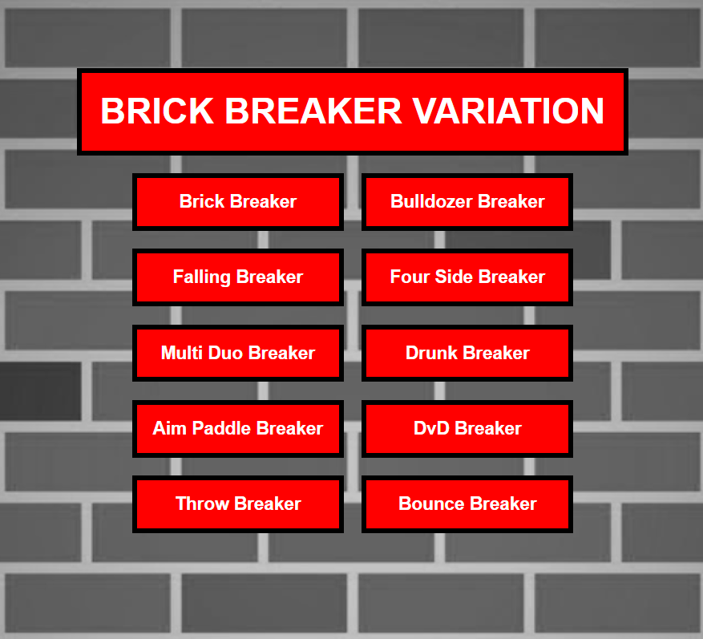
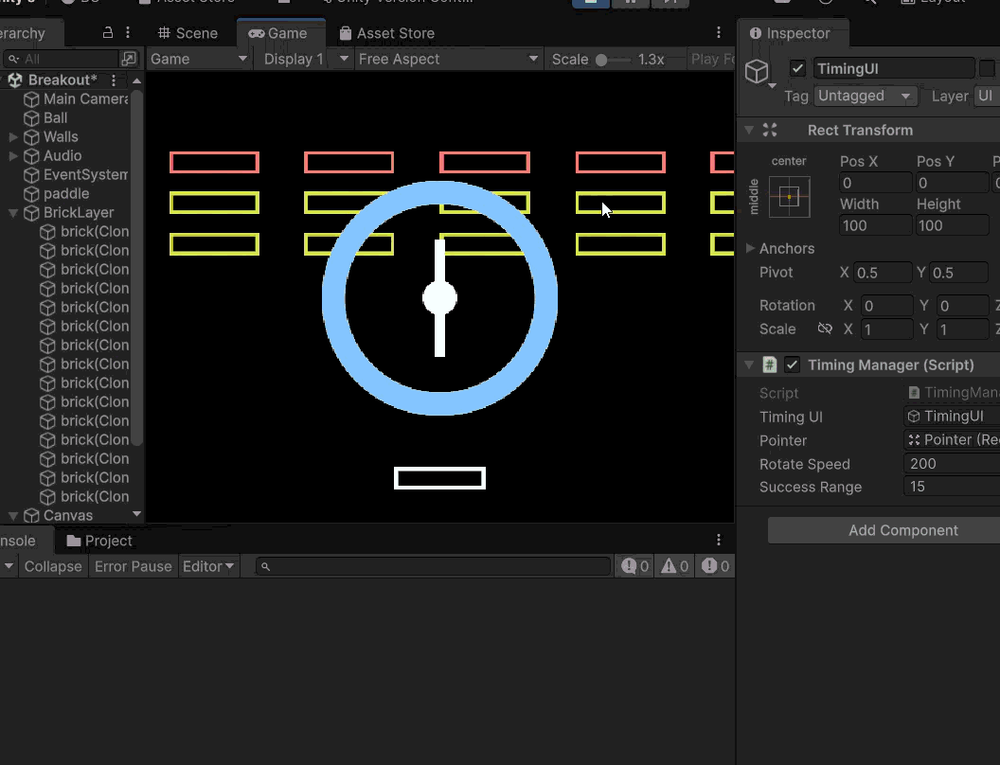

# Bianca's Journal 

## Context Statement (Week 1) 2026-01-22
### Make A Thing

This was interesting, i didnt want to do something too complicated for this to make a thing as I mainly overthink and overstressed. Mentioned in class that Gb studios was one of the recommendations as you don't need to code or program and its very new user friendly. With the idea of a drag and drop room style, I was thinking of something that I could make which was small but with some idea of a concept. Mainly stupid, quirky and hinting at a comedic idea, I thought of making a sibling concept. I have siblings myself, one twin and older sister and I have seen this joke which is like “ when you go to your sibling's room and just push something on the floor or close their lights and then walk away for no reason.” so i decided to make this small scenario to make a thing.

 I decided to add some extra rooms so you can explore but they don't really do much. I also took the original background of the small house and wide house and I brought it into photoshop to add more doorways. So I used the sample backgrounds and added to it to make the background I needed for my house. I also downloaded some free assets for gb studios for house items. I usually love drawing my own assets but because of time and the fact that I never have done some for these types of games which I found had some very specific colour and size criterias i thought it was safer to utilize online assets, I had to crop them for each item I decided to use. I also made the character move with an exemple so it wasn't hard to actually make. I wish I could have learned more about something more specific because I enjoyed it and wished I could dive deeper into what I could've made the character do.  But I wanted to have something first. I found that GB studios were very easy and interesting to use. After I figured out what each thing did, like moving from Game World to sprites or images it became easier. I downloaded the guide which helped. I still wasn't sure how to add sprites so I tried saving it in the same folder as others and it worked. 

The way to use the program is very intuitive and I found myself thinking that it would be fun to actually dive deeper into what you could do with it as I kept it very basic. My idea did not change much during the process as it was very simple to begin with. I did come across a problem which was that at a certain point after my computer crashed some of my sprites started to distort or glitch. They didn't used to but now they do. I tried to check online but many reasons were given but I couldn't find the solution. The game still worked so I didn't have the time to fix that error. Anyway, I loved that I was able to try gb studio. The only weird thing is that the key was “alt gr” on my windows computer to interact with the object because that is how it was in the example.

.png)
 
 

## Play Around In Unity (Week 2) 2026-01-29

I had started at first just doing the turtorial that comes with unity.

- I had done the playroom one where you add a bed and other bedroom objects. and then we added a rubber ball and a ramp. I discovered how to creat a material from within unity itslef and you can change the roughness and metalic slide of the material. I also added an extra component that gave it bounciness and gravity so it would fall and roll off the ramp.

- I also started the third tutorial where in a Kitchen we can add the audio to a boiling kitchen pot and make it loop

- I decided to stop and started fallowing a Tutorial thaT I was suggested to try by my friend and classmate. It's this Flappy Bird 2d unity turotial. video link:https://www.youtube.com/watch?v=XtQMytORBmM 

- It started rough as I was still having some difficulties with my .gitignore not working and keep on ending up with over 3460 things to commit. it took way to long but I finally got it to work.

- The next problem was that the script for Input(GetKeyDown) wasnt working for me and then it took a while to figure out that because of the update I had the new Input package in unity but using the old version in my script. So then I was able to allow the use of both and now it started to work 

- So I learned how to add a sprite renderer to add assets images, I also dicovered that you can color the backgroudn of the main camera. that was also difficult as my unity camera couldnt find flag propreties, so I had to do another search to figure it out. 

- now we have the bird going up if I press on the space bar and it falling if I dont press.
- we just added the pipes and and also discovered how to parent object 
- just learned about prefabs. we did it for the pipes. we made pipes and frm there we added the up pipe and down pipe therefore the pipe became a parent. After we drag the pipe into the assets and it made a prefab. Very interesting.
- We have now made it that the pipes appear in different hights and also that they delete themsleves after leaving the screen. 
-We also made a middle box in between the pipe to be able to do a score 

- Just started making a UI, to make a score, I have never made a UI before. It wa svery interesting. The tutorial is very informational and gave good explanation to why and how of each thing he did. 

- I added a Game Over Screen, also used the UI Button and Now if the Character dies the Game restart 

## Prototype Pawng Ideas (Week 3) (2026-02-05)

### Pawng Ideas 

So I decided to just think of ideas and see if any stick with me or if I wanted to explore deeper.

A couple of ideas that I had were the typical ones: power-up or more paddle.

We could have it that both paddles are connected in that if someone gets the power up there paddle gets a bit longer, but the other player gets a bit shorter, just like if they are stealing from each other. 

- Colour Switch: if the ball changes colours randomly and you have to change your paddle to that colour, if not, you lose a point, or it reduces the size of your paddle. The idea gimmick of not only trying to block a score on another player, but you also have to pay attention to the colour of the ball, and also the button to be able to change the paddle to the same colour as the ball, would be an interesting,g intense mechanics

- Spinning paddle obstacle in the middle 
Power-ups: slowing down, negative points, bombs, stunned, longer paddle, Faster ball. 

- Time-based block letter: a letter appears on the screen on your paddle. You need to click that letter on the Keyboard so it disappears and you can move your paddle again.

### Theme or similar to other games idea : 

- Foosball machine: having added a paddle in the middle. If you have to interact physically with it, like foosball. If we don't interact with the middle ones than it could be like paddles passing through the path like cars. The adding of bad paddle and a good paddle would be interesting and could bring a point system. Or if you hit a car, your paddle is stunned for a bit, or it grows shorter. 

- Pinball machine: We could make a pinball version where it's a 1v1 pinball. The player has two paddles. And the mechanism of the paddles is the same. Adding obstacles or objects that, if hit, give points could be interesting. It would be interesting to apply the pinball concept to the 2v2 aspect of pong. 

- Baseball: We would have you swing the paddle like a baseball bat. That would be interesting and could make it a bit harder. Though I would have to check if it works well. 

 - Pong Brick breaker. You could have a wall of brick in the middle, and both opponents have a ball bouncing, and they are trying to get rid of the obstacle of bricks in the middle and then when they reach each other, it could have added aspects, or right now stay the same pong but with two balls. 

- Froggers: you could have a moving paddle, and the player is the ball jumping on each paddle reach the other end before the other one. 

Other ideas: I thought maybe approaching it as a theme-based concept. Like, instead of being against, helping each other would be interesting.

- My sister had mentioned the idea of cooks. Like if the paddles were in themed pans and we had to throw ingredients to each other ( this idea could be a theme-based game or a 1v1), it would be interesting if you had to specifically send the ingredients that are asked to make the recipe; if not, you have to start over.

### Reviewing

I made some designs for the look and idea. I didnt have much time this week to try implementation as much as just talking about ideas and drawing images. 

I think my first approach was just spitballing ideas. What different variations or things could be added or modified? There are some ideas that I like better than others. Some I felt are interesting, but maybe stray away too much from the original concept or idea of pong. There is one that I found I liked more. 

I quite like the idea of the colour Switch. It would add an extra concentration aspect that would be great. Even would bring an easy way of taunting between players. I think that it could create a very fun, interesting idea. The way of switching colours needs to be figured out. Should it be more than one key, or should each player have their own colour key and they have to repeatedly click it until they get the right colour? Should I make it so that each player is not asked to have the same colour? Should it be the ball changing colour and the paddle needs to match, or should it be the words appearing or being voiced? There are many ways that I could implement this idea or even build on it. I feel like I need to make a more playable prototype to experience what people prefer or how people are playing based on the different mechanics 

I think that I would love to test intensity and concentration. Like having to follow the ball to score on the other player, but you always have to be alert or on edge to make sure you pay attention to the colour switch. I also think adding an extra key or even the stressful idea of clicking the same key multiple times to make sure you get the right colour is stressful, and when you over-click. I feel like it would bring a nice freak-out mechanic. 

You could even take the idea further and add another Switch. Like maybe the ball changes shaped and base of the shape you need to switch the paddle to be able to hit it or if the ball switches shapes then maybe randomly a player will be called to be the one that needs to change it or the person that has the ball coming towards them needs to change it because exemple a square ball would not bounce of. 

The idea of that freakout moment in 1v1 games is fun, you tunt and sometimes end up screaming because of stress. You could even implement a point system, or even a golden snitch idea. Like if the ball becomes gold, you need to be the fastest to click your bottom to get the mega points or something that makes it so that only one can get it, and it's again about speed, concentration, being on the edge, and having a kind of thrilling but tense feeling, enjoyably. 

I now would need to actually make a playable prototype idea of the less complicated one, but just the colour switching to start and see how people react. 
I did try to get into the code, but some things where breaking. It's my first time coding in Unity itslef so there are rules and way of thinking is different. I am not sure how to add it in a already started code. I will need more time but I did look in the code, I tried to add the random ball color change but it's not working 

## Breakout Prototype (Week 4) (2026-02-12)

# Some issues starting 
The start of this week was horrible. Unity and Rider where not working or vs code. It said that the code was wrong therefore i couldnt make changes. I couldnt figure out how to pull the teachers changes when i had cloned the repository, so i didnt have any of the new changes from class. after rider and unity didnt wnat to update my scripts or make them work. I searched online for a while trying to figure out how to fix it but i fixed atleast the unity and rider connects but I dont know how to pull changes from the teachers github without needing to redownload everything. 

# Insporation

ok so Breakout or in my Knowledge (Brick Breaker) as I was first introduced by the game on my dad's blackberry  when I was younger and he always let me play it when we went in the bus. Anyway, Breakout is the game that I had chosen in Pippin's class (loved that class!)  for the variation Jam wheere we needed to make some variations to an already existing game. I had alot of fun with it and had so many idea. Some in the submit where clanky but that because I submited more than the amount of variation needed. I kept them because I thought it was so fun. So for this prototype I wanted to not make changes that were similar to what I had done for his class. So i strated with writing down what I had alredy done and then think of something that would be a complet different approach

The project
[View this project online](https://biwanka.github.io/CART253/topics/Bianca_Gauthier_Variation_Jam/index.html)
view the Code : https://github.com/Biwanka/CART253/tree/main/topics/Bianca_Gauthier_Variation_Jam 

- so the variations that I had made where: 

- Falling Breaker: where when the ball hits the bricks, the bricks will fall instead of breaking and dissapearing. When the brick is hit they will fall and you need to catch the brick with your paddle, if you do not catch the brick, they will freeze at the bottom of your screen and therefore blocking your paddle. So this makes the area where your paddles moves become smaller if the bricks becomes an obsticles. it could also end up fulling blocking your paddle making it that you cant get to your ball with your paddle on time when the ball hits a brick

- Four Side Breaker: the concept of the original game is that the paddle is only at the bottom.but with this variation the paddle will be able to go on all the 4 size.depending on the coding it will only be one paddle that can move to all 4 sides or if not its that there will be 4 paddle one on each side that can be move seperatly. the ball will now not be able to bounce of any of the sides.and the brick will be placed in the middle of the screen

- Aim Paddle Breaker: the concept of the original game is that the paddle is only at the bottom.but i decided to make it that we have a horizontal and vertical paddle, in addition i decided to give free aim to the paddle.as the plus sign fallows the mouse cursor alsmot like the aim of a gun.

- Bounce Breaker: I dedcide to make a version that will be the contrary of the concept of the original game. instead of bouncing a ball on a paddle to break the bricks, instead the player will need to bounce a brick to a ball. like a brick on a trampoline that is moving in the top screen. basic idea i thought it would be funny to have a brick on a trampoline.

- Bulldozer Breaker: there is no actual physics. the ball dosent bouce off after hitting a brick. like its a bulldozer or lawnmower.

- Drunk Breaker: this one focuses on the concept of horizontal and veritcal but you cant move the paddle in the direction you would expect.the brick on the vertical can only move rigth and left with the mouse. and the horizontal brick can only move up and down with the mouse cursor. and then i decided to add the key board arrow to fill in what direction the paddle couldnt move with. very difficult to win I think i only did it once but that the point. its like your drunk and slow cant seem to understand your movement.

- DvD Breaker: because the game i chose had to do with something from my past i decided to all add another aspect that touches on that. I am going to use the boucing DVD logo. it was a common thing if you ever owned a DVD that when it was left on pause for long the logo would appear and start bouching on the 4 sides of the screen. The main Hype was when the logo actually finally hit the corner of the screen it was the biggest satisfaction. so i will change the ball to be the DvD logo and the ball will be able to hit the side of the screen. there will be bricks blocking the top right corner.Even if the player gets ride of all the bricks they will not win the game they need to continue until the DVD logo hits one of the corners. I have tested and it is possible 

- Multi_Duo Breaker: this one focuses on the concept of horizontal and veritcal but you cant move the paddle in the direction you would expect.the brick on the vertical can only move rigth and left with the mouse. and the horizontal brick can only move up and down with the mouse cursor.

- Throw Breaker: I dedcide to make a version that will be the contrary of the concept of the original game. instead of bouncing a ball on a paddle to break the bricks, instead the player will need to trow the bricks to hit the ball that is moving in the top screen. the player will have a pile of bricks and need to trow them so it hits the ball and the brick breaks. if the brick hits nothing gravity will do its thing and come back down in the hands of the player. 

# Thinking/Idea  
So I was trying to implement something that is completely different then the ideas I had before. I also wanted to have different ideas than the ones that I have seen in brick breaker.

- I have seen power ups falling after certain bricks got hit 
- I have seen that some bricks are steel so you cant break them 
- I have seen that some darker bricks need more than one hit to break them.

I liked the idea of the idea of having different brick than just the normal ones, but I didt want something that was passive in context, like the brick needs to be hit more than once or unbreakable, dosent have the player need to do anything or is not as stimulating.

- then I got the idea of wanting to add a timing mechanic , i feel like reaction type ideas are interesting to add in traditional comfort games. 

- I got to thinking of the different types of time/skill- based reaction mechanic:
              - Like hiting a circle that appears randomly on screen

              - Letter keys or arrows appear on screen that you have to press on the keyboards almost like a guitar hero. ex : a , c, a , d 

              - press and release. where those circle you press adn the circle shrinks and then you release when it reaches the size indicated. (but that one I crossed out because it feels like to long except if i make them small)

              - ring circles where a point rotates on the circle and you need to press when the point lands/ passover the section that is indicated

              - a point that when you clicks it kind of loads in a circle. like if you have a ring and you need to press and the border of the ring loads and you need to release or press when it reaches the indicated area. 

there are others but these are the ones that came to mind in the moment.

So the one that I ended up going with was the ring circle, i feel like not needing to keep your finger on a key would be a smarter idea as you are still needing to keeping look of the ball. I also thought that it could go well with the different colour bricks that we already implemented in class.

- Need to think/consider. I have to see if the ball pauses when the skill-base mechanic appears or does it continue and you need to double task. I prefer the idea of double tasking, however only when testing could I see if it is impossible or even fun or engaging. Or am I trying to have this almost impossible challenge, again there is acouple small directions/changes I could make to have the same skill-based mechanic but different outcomes or experience.

# Mechanic Idea 
Hitting a special-colored brick gives the player a “circle ring” (like a timing indicator).

The player must press the space bar at the right timing to break a really hard brick.
adding a skill-based timing mechanic into Breakout instead of just "ball hits → brick dies."

Mechanic Idea
When: The ball hits a special hard brick (specific color)

Then: - A circular timing ring UI appears
      - A marker rotates around the ring
      - Player must press Space at the correct moment
      - If timed correctly → brick breaks
      - If missed → brick stays + maybe ball bounces normally

Trying to introduce: - Player skill timing
                     - Risk vs reward
                     - Game pacing variation
                     - Interaction beyond paddle control

Optional Enhancements

- Make hard bricks require multiple successful hits (use an HP variable).
- Or different Hp areas : like the small red dots is the automatic kill 

Animate the ring visually (color change or radial fill for timing feedback).

Add sound effects for success/failure.

# Process

ok so I am familiar but not familiar with coding. For me p5js was great and I started to undertsand, then vanilla javascript brought me bakc to zero, I feel like i can understand in concept what needs to happen or kind of like some of the theory but how to fully implement or write the code and am not as famailiar/secure in it. I dont have many classes that needed it or teaches so i cant seem to become familiar or comfortable. so I searched a bit on a reating a skill-based timing ring in Unity. It mentions the UI and a Timing script. 

so I started with a adding a UI canvas and adding to that UI images, one for the ring and the other for the pointer. 
I also created an empty in the canvas and named it TimingUI. then to the TimingUi i added a component for a new script that I labled TimingManager. in the script a call the public gameobject timingUI and the pointer. I also added two public floats one for rotate speed and one for succesRange, I then made sure to drag the timingUI and the pointer on the inspector tab of the script in unity to mention what it should effect. i needed to create a section where we add the code to start the timing and also to see if the timing is active : true or false. i also made it that current brick equals current brick.

Right now the bricks dont dissapears but it may be 

# Things that still need to be implemented 

- I need to actually connect hardBrick with one of the coloured bricks. Just like we added the the point value of the brick if they are a new Color in the BrickLayer script, I would need to add a way to then say that those one is normal Brick and the other is Hard Brick. 

- 

