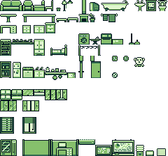
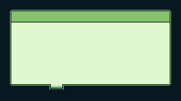
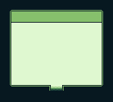
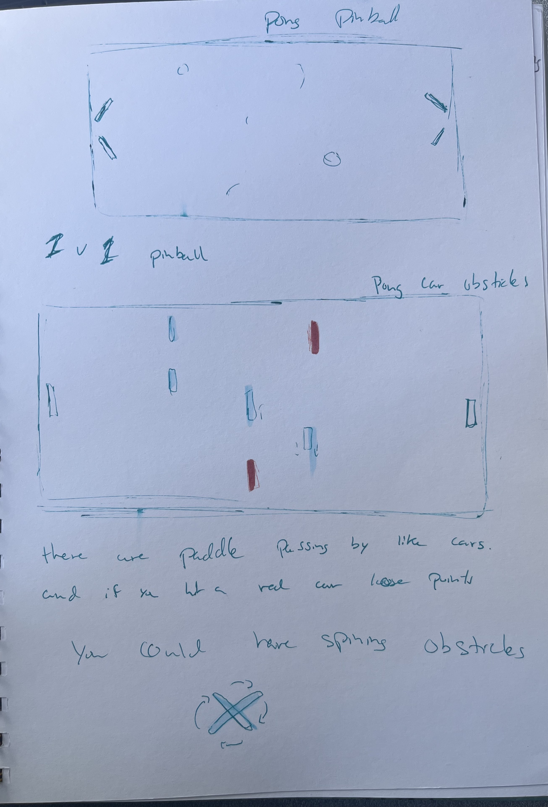
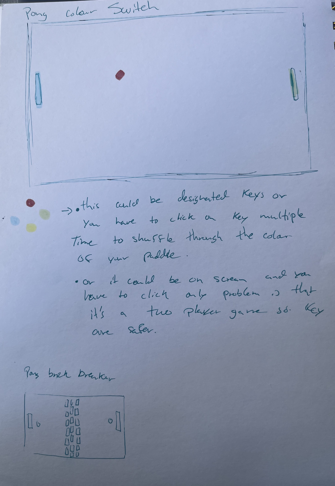

# Bianca's Journal 

## Context Statement (Week 1) 2026-01-22
### Make A Thing

This was interesting, i didnt want to do something too complicated for this to make a thing as I mainly overthink and overstressed. Mentioned in class that Gb studios was one of the recommendations as you don't need to code or program and its very new user friendly. With the idea of a drag and drop room style, I was thinking of something that I could make which was small but with some idea of a concept. Mainly stupid, quirky and hinting at a comedic idea, I thought of making a sibling concept. I have siblings myself, one twin and older sister and I have seen this joke which is like “ when you go to your sibling's room and just push something on the floor or close their lights and then walk away for no reason.” so i decided to make this small scenario to make a thing.

 I decided to add some extra rooms so you can explore but they don't really do much. I also took the original background of the small house and wide house and I brought it into photoshop to add more doorways. So I used the sample backgrounds and added to it to make the background I needed for my house. I also downloaded some free assets for gb studios for house items. I usually love drawing my own assets but because of time and the fact that I never have done some for these types of games which I found had some very specific colour and size criterias i thought it was safer to utilize online assets, I had to crop them for each item I decided to use. I also made the character move with an exemple so it wasn't hard to actually make. I wish I could have learned more about something more specific because I enjoyed it and wished I could dive deeper into what I could've made the character do.  But I wanted to have something first. I found that GB studios were very easy and interesting to use. After I figured out what each thing did, like moving from Game World to sprites or images it became easier. I downloaded the guide which helped. I still wasn't sure how to add sprites so I tried saving it in the same folder as others and it worked. 

The way to use the program is very intuitive and I found myself thinking that it would be fun to actually dive deeper into what you could do with it as I kept it very basic. My idea did not change much during the process as it was very simple to begin with. I did come across a problem which was that at a certain point after my computer crashed some of my sprites started to distort or glitch. They didn't used to but now they do. I tried to check online but many reasons were given but I couldn't find the solution. The game still worked so I didn't have the time to fix that error. Anyway, I loved that I was able to try gb studio. The only weird thing is that the key was “alt gr” on my windows computer to interact with the object because that is how it was in the example.

.png)
 
 

## Play Around In Unity (Week 2) 2026-01-29

I had started at first just doing the turtorial that comes with unity.

- I had done the playroom one where you add a bed and other bedroom objects. and then we added a rubber ball and a ramp. I discovered how to creat a material from within unity itslef and you can change the roughness and metalic slide of the material. I also added an extra component that gave it bounciness and gravity so it would fall and roll off the ramp.

- I also started the third tutorial where in a Kitchen we can add the audio to a boiling kitchen pot and make it loop

- I decided to stop and started fallowing a Tutorial thaT I was suggested to try by my friend and classmate. It's this Flappy Bird 2d unity turotial. video link:https://www.youtube.com/watch?v=XtQMytORBmM 

- It started rough as I was still having some difficulties with my .gitignore not working and keep on ending up with over 3460 things to commit. it took way to long but I finally got it to work.

- The next problem was that the script for Input(GetKeyDown) wasnt working for me and then it took a while to figure out that because of the update I had the new Input package in unity but using the old version in my script. So then I was able to allow the use of both and now it started to work 

- So I learned how to add a sprite renderer to add assets images, I also dicovered that you can color the backgroudn of the main camera. that was also difficult as my unity camera couldnt find flag propreties, so I had to do another search to figure it out. 

- now we have the bird going up if I press on the space bar and it falling if I dont press.
- we just added the pipes and and also discovered how to parent object 
- just learned about prefabs. we did it for the pipes. we made pipes and frm there we added the up pipe and down pipe therefore the pipe became a parent. After we drag the pipe into the assets and it made a prefab. Very interesting.
- We have now made it that the pipes appear in different hights and also that they delete themsleves after leaving the screen. 
-We also made a middle box in between the pipe to be able to do a score 

- Just started making a UI, to make a score, I have never made a UI before. It wa svery interesting. The tutorial is very informational and gave good explanation to why and how of each thing he did. 

- I added a Game Over Screen, also used the UI Button and Now if the Character dies the Game restart 

## Prototype Pawng Ideas (Week 3) (2026-02-05)

### Pawng Ideas 

So I decided to just think of ideas and see if any stick with me or if I wanted to explore deeper.

A couple of ideas that I had were the typical ones: power-up or more paddle.

We could have it that both paddles are connected in that if someone gets the power up there paddle gets a bit longer, but the other player gets a bit shorter, just like if they are stealing from each other. 

- Colour Switch: if the ball changes colours randomly and you have to change your paddle to that colour, if not, you lose a point, or it reduces the size of your paddle. The idea gimmick of not only trying to block a score on another player, but you also have to pay attention to the colour of the ball, and also the button to be able to change the paddle to the same colour as the ball, would be an interesting,g intense mechanics

- Spinning paddle obstacle in the middle 
Power-ups: slowing down, negative points, bombs, stunned, longer paddle, Faster ball. 

- Time-based block letter: a letter appears on the screen on your paddle. You need to click that letter on the Keyboard so it disappears and you can move your paddle again.

### Theme or similar to other games idea : 

- Foosball machine: having added a paddle in the middle. If you have to interact physically with it, like foosball. If we don't interact with the middle ones than it could be like paddles passing through the path like cars. The adding of bad paddle and a good paddle would be interesting and could bring a point system. Or if you hit a car, your paddle is stunned for a bit, or it grows shorter. 

- Pinball machine: We could make a pinball version where it's a 1v1 pinball. The player has two paddles. And the mechanism of the paddles is the same. Adding obstacles or objects that, if hit, give points could be interesting. It would be interesting to apply the pinball concept to the 2v2 aspect of pong. 

- Baseball: We would have you swing the paddle like a baseball bat. That would be interesting and could make it a bit harder. Though I would have to check if it works well. 

 - Pong Brick breaker. You could have a wall of brick in the middle, and both opponents have a ball bouncing, and they are trying to get rid of the obstacle of bricks in the middle and then when they reach each other, it could have added aspects, or right now stay the same pong but with two balls. 

- Froggers: you could have a moving paddle, and the player is the ball jumping on each paddle reach the other end before the other one. 

Other ideas: I thought maybe approaching it as a theme-based concept. Like, instead of being against, helping each other would be interesting.

- My sister had mentioned the idea of cooks. Like if the paddles were in themed pans and we had to throw ingredients to each other ( this idea could be a theme-based game or a 1v1), it would be interesting if you had to specifically send the ingredients that are asked to make the recipe; if not, you have to start over.

### Reviewing

I made some designs for the look and idea. I didnt have much time this week to try implementation as much as just talking about ideas and drawing images. 

I think my first approach was just spitballing ideas. What different variations or things could be added or modified? There are some ideas that I like better than others. Some I felt are interesting, but maybe stray away too much from the original concept or idea of pong. There is one that I found I liked more. 

I quite like the idea of the colour Switch. It would add an extra concentration aspect that would be great. Even would bring an easy way of taunting between players. I think that it could create a very fun, interesting idea. The way of switching colours needs to be figured out. Should it be more than one key, or should each player have their own colour key and they have to repeatedly click it until they get the right colour? Should I make it so that each player is not asked to have the same colour? Should it be the ball changing colour and the paddle needs to match, or should it be the words appearing or being voiced? There are many ways that I could implement this idea or even build on it. I feel like I need to make a more playable prototype to experience what people prefer or how people are playing based on the different mechanics 

I think that I would love to test intensity and concentration. Like having to follow the ball to score on the other player, but you always have to be alert or on edge to make sure you pay attention to the colour switch. I also think adding an extra key or even the stressful idea of clicking the same key multiple times to make sure you get the right colour is stressful, and when you over-click. I feel like it would bring a nice freak-out mechanic. 

You could even take the idea further and add another Switch. Like maybe the ball changes shaped and base of the shape you need to switch the paddle to be able to hit it or if the ball switches shapes then maybe randomly a player will be called to be the one that needs to change it or the person that has the ball coming towards them needs to change it because exemple a square ball would not bounce of. 

The idea of that freakout moment in 1v1 games is fun, you tunt and sometimes end up screaming because of stress. You could even implement a point system, or even a golden snitch idea. Like if the ball becomes gold, you need to be the fastest to click your bottom to get the mega points or something that makes it so that only one can get it, and it's again about speed, concentration, being on the edge, and having a kind of thrilling but tense feeling, enjoyably. 

I now would need to actually make a playable prototype idea of the less complicated one, but just the colour switching to start and see how people react. 
